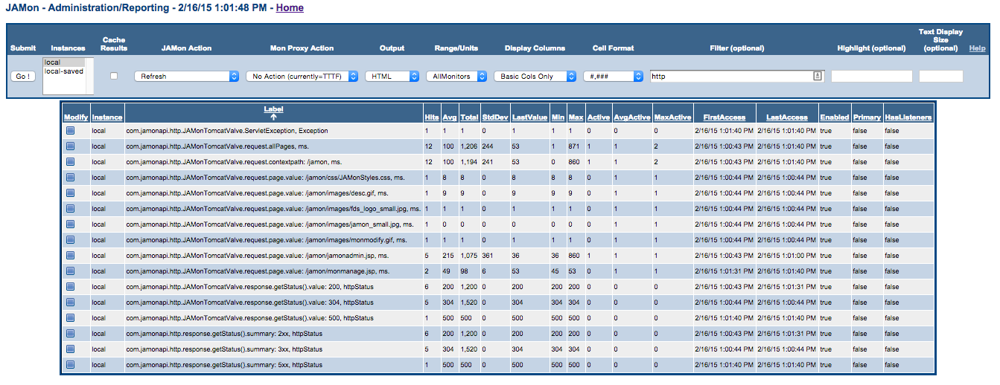
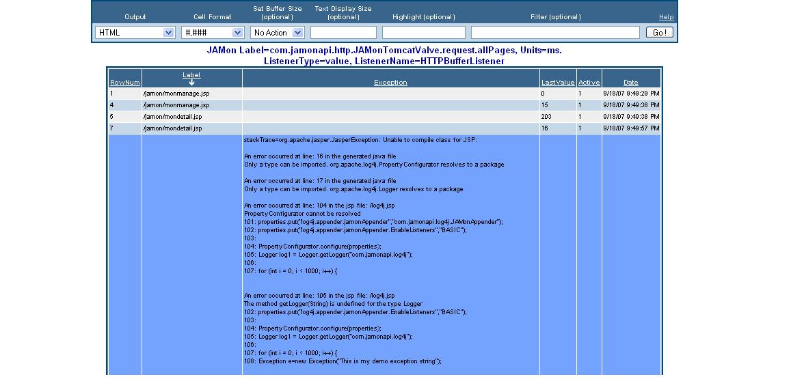

# JAMon HTTP Monitoring


## Quick Navigation

**Core Documentation:**
- [📋 Documentation Index](README.md) - Complete guide to all JAMon documentation
- [🚀 Getting Started](../README.md) - JAMon overview and quick start
- [⚡ Core API](core-api.md) - Basic JAMon monitoring concepts

**Related Guides:**
- [🌐 Jakarta Servlet Filter](servlet-filter.md) - Modern web application monitoring
- [📊 SQL Monitoring](sql-monitoring.md) - Database monitoring
- [👂 JAMon Listeners](listeners.md) - Event listeners for detailed monitoring
- [🖥️ JAMon Web App](jamon-war.md) - Web interface for monitoring data

## Table of Contents

- [Monitoring HTTP Requests](#monitoring-http-requests)
- [Interpreting JAMon HTTP Data](#interpreting-jamon-http-data)
- [Configuring the JAMon HTTP Monitor](#configuring-the-jamon-http-monitor)
- [Sample Configuration Files](#sample-configuration-files)

## Monitoring HTTP Requests

JAMon HTTP Monitoring uses reflection to monitor different aspects of the container's HttpServletRequest and HttpServletResponse objects. With JAMon you can monitor individual page performance, frequency of each HTTP status code (200, 404 etc.), number of bytes returned in a response, Servlet exceptions and much more. As is always the case with JAMon, HTTP monitoring can be enabled/disabled at runtime. HTTP monitoring requires no application code changes.

### Setup by Container Type

#### Tomcat 6, 7, 8+

1. Put `jamon-2.7.jar` (or higher) in the tomcat 'lib' directory
2. Put `jamon.war` (or higher) in the tomcat 'webapps' directory
3. Add the following Valve line to Tomcat's `server.xml` file:

```xml
<Engine name="Catalina" defaultHost="localhost">
<Valve className="com.jamonapi.http.JAMonTomcatValve"/>
```

#### Tomcat 4/5/5.5

1. Put `jamon-2.7.jar` (or higher) in the tomcat 'common/lib' directory
2. Put `jamontomcat-2.7.jar` (or higher) in the tomcat 'server/lib' directory (Note this is not jamon-2.7.jar)
3. Put `jamon.war` (or higher) in the tomcat 'webapps' directory
4. Add the following Valve line to Tomcat's `server.xml` file using the appropriate version. Note only one of the valve lines should be used, and also note the package is 'com.jamontomcat' and not 'com.jamonapi':

```xml
<Engine name="Catalina" defaultHost="localhost">
<Valve className="com.jamontomcat.JAMonTomcat55Valve"/>
```

#### JBoss 4.0.5/4.2

Other versions may work too.

1. Put `jamon-2.7.jar` (or higher) in the jboss instance 'lib' directory (ex. default/lib)
2. Put `jamon.war` (or higher) in the jboss instance 'deploy' directory (ex. default/deploy)
3. Add the following Valve line to Tomcat's `server.xml` file (i.e. jbossweb-tomcat55.sar/server.xml):

```xml
<Engine name="Catalina" defaultHost="localhost">
<Valve className="com.jamonapi.http.JAMonTomcatValve"/>
```

#### Jetty 8/9

1. Put `jamon-2.77.jar` (or higher) in the jetty 'lib/etc' directory
2. Put `jamon.war` in the jetty 'webapps' directory
3. Add the following Handler line to Jetty's `jetty.xml` file (i.e. etc/jetty.xml):

```xml
<Set name="handler">
  ...
  <Item>
   <New id="JAMonHandler" class="com.jamonapi.http.JAMonJettyHandlerNew"/>
  </Item> 
</Set>
```

#### Jetty 6.1.5

1. Put `jamon-2.7.jar` (or higher) in the jetty 'lib' directory (note in later versions of jetty the jamon jar should be put in lib/ext)
2. Put `jamon.war` in the jetty 'webapps' directory
3. Add the following Handler line to Jetty's `jetty.xml` file (i.e. etc/jetty.xml):

```xml
<Set name="handler">
  ...
  <Item>
     <New id="JAMonHandler" class="com.jamonapi.http.JAMonJettyHandler"/>
  </Item>
</Set>
```

#### Web Application

Add the appropriate servlet filter (`com.jamonapi.http.JAMonServletFilter`) to the application's `web.xml` file.

#### Custom Monitoring

Should you use another container you can use the `com.jamonapi.http.HttpMonFactory` class to easily monitor any web container.

## Interpreting JAMon HTTP Data

By default JAMon will track something similar to the following (The screen snapshot was taken while monitoring tomcat6). However, with simple configuration via `server.xml`, or `jetty.xml` - any HttpServletRequest, or HttpServletResponse method that takes no arguments, and returns an Object can be monitored (i.e. `request.getRequestURI()` for example). This is covered in more detail later in this document. Note all HTTP monitors can be seen by entering 'http' into the `jamonadmin.jsp` 'filter' field.

### Default HTTP Monitors

- **com.jamonapi.http.JAMonTomcatValve.request.allPages, ms.** - Stats for all resources/pages executed by the container. As is the case for all JAMon monitors hits, avg, min, max, currently active and more stats are tracked. Anytime the units are ms (milliseconds) the label tracks execution time.

- **com.jamonapi.http.JAMonTomcatValve.request.contextpath: /jamon, ms.** - Page execution stats for all pages in a context

- **com.jamonapi.http.JAMonTomcatValve.request.page.value: /jamon/jamonadmin.jsp, ms.** - Page execution stats for individual pages in the container

- **com.jamonapi.http.JAMonTomcatValve.response.getContentCount(), bytes** - Size in bytes of all pages

- **com.jamonapi.http.JAMonTomcatValve.response.getStatus().value: 200, httpStatus** - Number of resources that return a particular HTTP status code. In this example the HTTP status code is 200

- **com.jamonapi.http.response.getStatus().summary: 5xx, httpStatus** - Number of resources that return the more general HTTP status code categories of 1xx, 2xx, 3xx, 4xx, 5xx. In this example the HTTP status code is 5xx

- **com.jamonapi.http.JAMonTomcatValve.ServletException** - Number of servlet exceptions thrown by the container



### Buffer Listeners for HTTP Details

Any JAMon buffer listener can be attached to any JAMon monitor. This allows you to not only look at the aggregate stats above, but look at interesting details such as the details of when the slowest page was executed, or the ServletException stack trace, or the most recent N page requests.

JAMon introduces the HttpBufferListener which puts a stack trace in the details buffer should one occur during a page request. The following is an example of what one might look like. (Note stack traces can also be seen in any of the other buffer listeners, however not as a separate column). The following buffer listener was attached to 'com.jamonapi.http.JAMonTomcatValve.request.allPages', and so would have a FIFOBuffer of the last N requests. As always JAMon buffer listeners can be added/removed at runtime.

The first 4 lines of the report show successful page invocations. The columns represent the row number in the report (RowNum), the resource/page name (Label), the stack trace if one occurred (Exception), the execution time in ms. (LastValue), the number of pages that were executing when this one was (Active), and the date-time when the resource/page was invoked. The 5th line shows a page that had a stack trace.



## Configuring the JAMon HTTP Monitor

JAMon can monitor various aspects of servlet requests and responses via declarative configuration. This is done via specifying a comma delimited string in the `server.xml`, or `jetty.xml` files, or programmatically by calling the `setSummaryLabel(String)` method.

### Configuration Example

What follows is a sample tomcat valve that specifies the default monitors explicitly:

```xml
<Engine name="Catalina" defaultHost="localhost">
<Valve className="com.jamonapi.http.JAMonTomcatValve" summaryLabels="request.getRequestURI().ms as allPages, 
request.getRequestURI().value.ms as page, 
response.getContentCount().bytes, 
response.getStatus().value.httpStatus, 
request.contextpath.ms" />
```

The above causes the `JAMonTomcatValve.setSummaryLabels` method to be called with the comma delimited String passed as an argument. A '.' separates tokens within one monitor. The String is parsed to the following 5 monitors:

### Monitor Configuration Details

#### request.getRequestURI().ms as allPages
Each monitor begins with either 'request', or 'response' followed by a method name. Any method that is in HttpServletRequest, HttpServletResponse that takes no arguments and returns a value can be called. In this example `getRequestURI()` is called. Because the method name you specify is used to make a call based on reflection it is important you get the case right and have no typos. In addition any method can also be called that matches these criterion and also inherits from these classes. For example any method from Tomcat's `org.apache.catalina.connector.Request`, or `org.apache.catalina.connector.Response`. The next value specifies to use the units of 'ms.' (milliseconds). Implicitly these units also tell JAMon to time the request. 'ms.' are the only units that will time the request. 'as allPages' is an optional alias that will can be used to make the JAMon label more readable.

**Example JAMon Label:** `com.jamonapi.http.JAMonTomcatValve.request.allPages, ms.`

#### request.getRequestURI().value.ms as page
This monitor is similar to the above except for the use of the keyword 'value'. In this case 'value' tells JAMon to take the value that the `request.getRequestURI()` method returns and use it in the JAMon label. `getRequestURI()` returns the requested page name such as '/jamon/jamonadmin.jsp'. The effect of this summary label is to create a JAMon label of the following format: `com.jamonapi.http.JAMonTomcatValve.request.page.value: /jamon/jamonadmin.jsp, ms.`

#### response.getContentCount().bytes
This label calls the `HttpServletResponse.getContentCount()` method and passes its return value (an int indicating bytes in the response) to the monitor. This allows JAMon to track such stats as the average, and max bytes in a response. The units are in 'bytes'. Note any unit that is not 'ms.' will take the return value and use it as the JAMon value if it is a number or if the method returns a String it will simply pass the number 1 to JAMon having the effect of only 'counting' the label.

**JAMon Label:** `com.jamonapi.http.JAMonTomcatValve.response.getContentCount(), bytes`

#### response.getStatus().value.httpStatus
This label calls the `HttpServletResponse.getStatus()` method which returns the [HTTP status code](http://www.w3.org/Protocols/HTTP/HTRESP.html) of the request (i.e. 200=ok, 404=file not found). It uses the special token 'value' to indicate that the value returned from the function (200, 404 etc) will be used as part of the JAMon key. Remember JAMon depends on keys being relatively unique, so don't use 'value' for something that can potentially generate a large number of keys (`request.getQueryString()` for example).

By default JAMon will not add any new HTTP Monitoring labels if the total number of JAMon monitor labels is greater than 5000. However, any existing JAMon entries will still be updated. In the Tomcat Valve, Jetty Handler, and Servlet filter this value can be changed by calling the `setSize(int size)` method. If '0' is passed the number of HTTP monitors can grow unbounded.

**Example JAMon Label:** `com.jamonapi.http.JAMonTomcatValve.response.getStatus().value: 404, httpStatus`

#### request.contextpath.ms
In addition to 'value' there are two other keywords that allow you to generate a JAMon key. They are 'url', and 'contextpath'. 'contextpath' will use the return value from `request.getContextPath()` as part of the key. An example of a return value is '/jamon'. 'url' will use `request.getRequestURI()` as part of the key. Any value other than 'request', 'response', 'methodName()', 'value', 'contextpath', 'url' and '.' will be used as the units. 'value', 'contextpath', and 'url' can be used in combination. They will be used as part of the key in the order they are specified.

**Example JAMon Label:** `com.jamonapi.http.JAMonTomcatValve.request.contextpath: /jamon, ms.`

#### Additional Example
`request.getStatus().contextpath.value.ms` - Using the above mentioned keywords this summary label would return the following representative JAMon label: `com.jamonapi.http.JAMonTomcatValve.request.getStatus().contextpath: /jamon, value: 404` (i.e. shows how many 404 errors occurred in the jamon context).

### Special Keywords

- **'default'** - Uses the HTTP monitor defaults as you would expect. However you can also add to default by providing a string like the following: `default, request.getStatus().contextpath.value.ms`
- **'demo'** - Only to be used so you can see many of the possible monitors and shouldn't be used in production. 'demo' is an easy way to see what other summary labels you may want to add. Keep in mind some of the 'demo' labels may not be very helpful as it is really a dumb cartesian product of possibilities ignoring whether or not they are useful.

Regardless which summary label you use JAMon will always put the page name, and stack trace (should there be one) in the details buffer. Note other methods that are part of the JAMonTomcatValve's and the JAMonJettyHandler can also be called in the same way 'setSummaryLabel' was called.

## Sample Configuration Files

- [Sample Tomcat 6 server.xml file](../src/LegacyJAMonUsersGuide285/tomcat6_server.xml)
- [Sample JBoss 4.0.5 server.xml file](../src/LegacyJAMonUsersGuide285/jboss_server.xml)
- [Sample Jetty 6.1.5 jetty.xml file](../src/LegacyJAMonUsersGuide285/jetty.xml)

## JAMon 3.0 HTTP Monitoring

**For JAMon 3.0 users:** See the [Jakarta Servlet Filter documentation](servlet-filter.md) for modern HTTP monitoring with Jakarta EE support and enhanced features. The legacy HTTP monitoring described above is preserved for backward compatibility.

## Related Documentation

- [Jakarta Servlet Filter](servlet-filter.md) - Modern JAMon 3.0 HTTP monitoring
- [JAMon Listeners](listeners.md) - Event listeners for detailed HTTP monitoring
- [Core API Guide](core-api.md) - Basic JAMon monitoring concepts