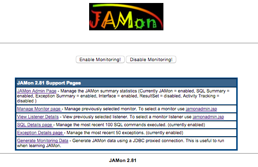
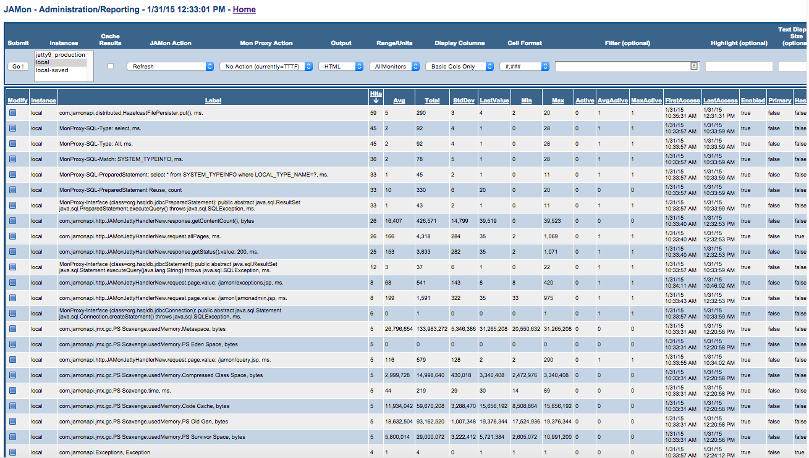
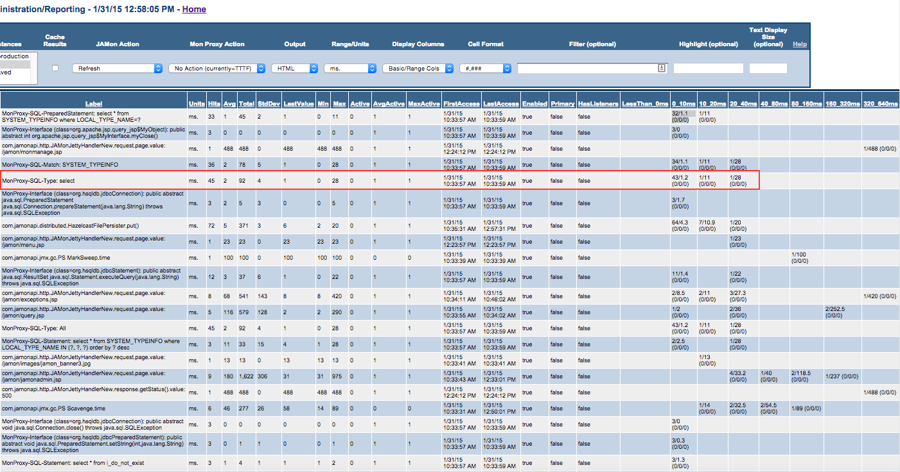

# JAMon Web Application (WAR)

## Quick Navigation

**Core Documentation:**
- [📋 Documentation Index](README.md) - Complete guide to all JAMon documentation
- [🚀 Getting Started](../README.md) - JAMon overview and quick start
- [⚡ Core API](core-api.md) - Basic JAMon monitoring concepts

**Integration Guides:**
- [🌐 Jakarta Servlet Filter](servlet-filter.md) - Configure web application monitoring
- [🔗 HTTP Monitoring](http-monitoring.md) - Container-level HTTP monitoring
- [📊 SQL Monitoring](sql-monitoring.md) - Database monitoring
- [👂 JAMon Listeners](listeners.md) - Event listeners for detailed monitoring
- [📈 JMX Monitoring](jmx-monitoring.md) - Alternative to web interface

## Table of Contents

- [The JAMon Web Application (WAR)](#the-jamon-web-application-war)
- [Viewing JAMon Summary Data](#viewing-jamon-summary-data)
- [Ranges](#ranges)

## The JAMon Web Application (WAR)

JAMon comes with the `jamon.war` web application. This application allows developers to view JAMon statistics and manage JAMon. The main menu can be accessed at `http://host:port/jamon/`. See the online help in the JAMon web application for more information.

### Main Menu

The JAMon web application provides a comprehensive interface for monitoring and managing your application's performance:

### Key Features

- **Real-time Statistics** - View current monitoring data
- **Historical Data** - Access accumulated performance metrics
- **Configuration Management** - Enable/disable monitors at runtime
- **Export Capabilities** - Download data in multiple formats
- **Interactive Analysis** - Sort, filter, and drill down into data

## Viewing JAMon Summary Data

### jamonadmin.jsp

`jamonadmin.jsp` allows you to view/query the JAMon statistics via a sortable HTML report, XML or an Excel spreadsheet. To view JAMon statistics you must put the jamon jar file in your server's classpath and configure your server.

### Report Features

- **Sortable Columns** - Click any column header to sort
- **Filtering** - Use the filter field to narrow results
- **Export Options** - Download as HTML, XML, or Excel
- **Real-time Updates** - Refresh to see current data
- **Detailed Views** - Drill down for specific monitor details

### Key Metrics Displayed

Each monitor shows comprehensive statistics:
- **Hits** - Number of times the monitor was called
- **Avg** - Average execution time or value
- **Total** - Sum of all values
- **Min/Max** - Minimum and maximum values recorded
- **Active** - Currently executing instances
- **First/Last Access** - Timing information

## Ranges

`jamonadmin.jsp` displays aggregate statistics such as hits, average, min, max and others. JAMon also has the concept of ranges that allow developers to see a better breakdown of the monitoring data. For example the screen snapshot below shows different ranges associated with all monitors with 'ms.' units.

### Range Analysis Example

As an example the SQL select statement (monitor label 'MonProxy-SQL-Type: select') was executed 45 times and averaged 2 ms. By looking at the 14 range columns (LessThan_0ms, 0_10ms, 10_20ms, 20_40ms...) you can see this further breaks down to:

- **0_10ms** - 43 queries taking an average of 1.2 ms. took between 0 and 10 ms
- **10_20ms** - 1 query taking 11 ms. took between 10 and 20 ms  
- **20_40ms** - 1 query taking 28 ms. took between 20 and 40 ms

### Benefits of Range Analysis

Ranges combined with [JAMon listeners](listeners.md) (which let you see the details of individual invocations) are a great way to help you better see the anomalies in your data. This allows you to:

- **Identify Performance Patterns** - See distribution of response times
- **Spot Outliers** - Quickly identify unusually slow operations
- **Capacity Planning** - Understand typical vs. peak performance
- **Troubleshooting** - Focus on problematic performance ranges

## JAMon 3.0 Web Application

**For JAMon 3.0 users:** The web application has been updated for Jakarta EE compatibility. All existing functionality is preserved.

> **Build Note:** The `jamon-war` module is **not** part of the parent POM multi-module build. To build the WAR, run `mvn clean package` from the `jamon-war/` directory separately.

## Deployment Instructions

### JAMon 3.0 Deployment
1. Build the WAR: `cd jamon-war && mvn clean package`
2. Ensure your server supports Jakarta EE (Tomcat 11+, etc.)
3. Deploy the resulting `jamon-3.0.war` to your server's webapps directory
4. Ensure `jamon-core-3.0.jar` and `jamon-http-jakarta-3.0.jar` are in server classpath
5. Access via `http://host:port/jamon-3.0/`

### Legacy JAMon 2.x Deployment
1. Deploy `jamon.war` to your server's webapps directory
2. Ensure `jamon-2.x.jar` is in server classpath
3. Access via `http://host:port/jamon/`

## Related Documentation

- [Jakarta Servlet Filter](servlet-filter.md) - Configure web application monitoring
- [HTTP Monitoring](http-monitoring.md) - Container-level HTTP monitoring  
- [JAMon Listeners](listeners.md) - Event listeners for detailed monitoring
- [Core API Guide](core-api.md) - Basic JAMon monitoring concepts