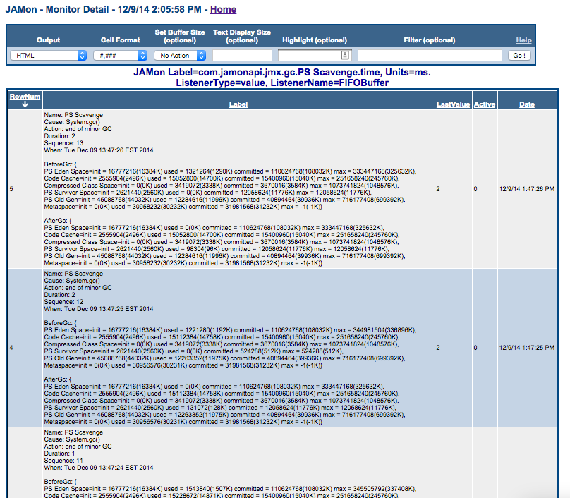

# JAMon JMX Monitoring


## Quick Navigation

**Core Documentation:**
- [📋 Documentation Index](README.md) - Complete guide to all JAMon documentation
- [🚀 Getting Started](../README.md) - JAMon overview and quick start
- [⚡ Core API](core-api.md) - Basic JAMon monitoring concepts

**Related Guides:**
- [📊 SQL Monitoring](sql-monitoring.md) - SQL and JDBC monitoring details
- [🔗 HTTP Monitoring](http-monitoring.md) - HTTP request and response monitoring
- [🗝 Log4j Appender](log4j-appender.md) - Log4j integration for logging metrics
- [👂 JAMon Listeners](listeners.md) - Event listeners for detailed monitoring
- [🖥️ JAMon Web App](jamon-war.md) - Web interface alternative to JMX

## Table of Contents

- [Introduction](#introduction)
- [Log4j Monitoring](#log4j-monitoring)
- [HTTP Page Requests](#http-page-requests)
- [HTTP Status Code Summary](#http-status-code-summary)
- [SQL Monitoring](#sql-monitoring)
- [Exception Monitoring](#exception-monitoring)
- [Garbage Collection Info](#garbage-collection-info)
- [JAMon Custom Metrics](#jamon-custom-metrics)
- [Managing JAMon](#managing-jamon)
- [Delta Monitoring](#delta-monitoring)

## Introduction

The Java Management Extensions (JMX) technology is a standard part of the Java Platform. With JMX developers can expose and manage their application via any JMX enabled console (Examples of these consoles are jconsole and visualvm).

As of JAMon 2.80, JAMon allows all monitors to be viewed via a JMX console. Some monitors are automatically displayed in the JMX console (for example Garbage Collection metrics), and others would need to be explicitly included (Note: All JAMon data is also viewable via the JAMon war).

### JAMon JMX Capabilities Overview

There is also [a short video](http://youtu.be/RM0bb2uq83E) that covers most of JAMon's JMX capabilities.

1. **Log4j** - Counts for Log4j log levels: TRACE, DEBUG, WARNING, INFO, ERROR, FATAL, etc.
2. **HTTP Page Requests** - Metrics for page hits in a web application. Metrics include count, average time, total time, max time, min time and more
3. **HTTP Status Code Summary** - A count of HTTP status codes in the general categories 1xx, 2xx, 3xx, 4xx, 5xx
4. **SQL** - Metrics for SQL statements including select, insert, delete, update and more. Metrics include count, average time, total time, max time, min time and more
5. **Exceptions** - A count of exceptions thrown by the application. You can also view the most recent stack trace
6. **Garbage Collection Info** - Metrics for the garbage collector are automatically stored in JAMon. This allows developers to look at details of the garbage collector without grepping a log. It tracks the following garbage collector metrics: how often it fires, how long it takes, how much memory it frees and more
7. **JAMon Custom Metrics** - Developers can easily expose any JAMon monitor to JMX by simply adding the monitor label, and units to the jamonapi.properties file
8. **Managing JAMon** - The following functions can be performed via a JMX enabled GUI such as jconsole: Enable/Disable/Reset JAMon monitors
9. **Deltas** - Display how much the JAMon monitors have changed (delta) since the last time the monitor was viewed


## Log4j Monitoring

The above image is an example of the JAMon JMX Log4j data. It shows that each of the log levels were called 4000 times except TRACE, which wasn't called at all. The [JAMon log4j appender](log4j-appender.md) must be enabled for this data to appear.

### Log Level Tracking
- **TRACE** - Finest level of logging
- **DEBUG** - Debug information 
- **INFO** - Informational messages
- **WARN** - Warning messages
- **ERROR** - Error conditions
- **FATAL** - Very severe error events

## HTTP Page Requests

This section represents any page hits (jsp, servlet, html, etc) in a web application.

### Requirements and Features
- To enable this capability [JAMon HTTP monitoring](http-monitoring.md) must be enabled
- The metrics can either appear as 'Jamon.HttpPageRequests' or a label associated with the server type such as 'Jamon.PageRequests.Jetty' or 'Jamon.PageRequests.Tomcat'
- **Note:** If you are using a different web container you can still track page request metrics by using [JAMon Custom Metrics](#jamon-custom-metrics)

### Tracked Metrics
As you can see below the following are tracked for the page requests: hits, average execution time, max execution time and all the other standard JAMon metrics. `_Count08_640_1280ms` contains the count of page hits that took between 640 and 1280 ms. The same principle applies to the other similarly named fields.


## HTTP Status Code Summary

The example below shows how the frequency of returned [HTTP status codes](http://en.wikipedia.org/wiki/List_of_HTTP_status_codes) from the web server.


### Status Code Categories
- **1xx** - Informational responses
- **2xx** - Success responses  
- **3xx** - Redirection messages
- **4xx** - Client error responses
- **5xx** - Server error responses

## SQL Monitoring

This section represents any SQL commands executed by the application.

### Requirements and Features
- To enable this capability [SQL monitoring](sql-monitoring.md) must be enabled
- There will be a JMX entry for each of the following SQL commands: select, insert, update, delete. There is also one for 'All' which aggregates all SQL commands
- As you can see below the following are tracked: hits, average execution time, max execution time and all the other standard JAMon metrics. `_Count08_640_1280ms` contains the number of SQL commands that took between 640 and 1280 ms. The same principle applies to the other similarly named fields


## Exception Monitoring

This section represents any Exceptions thrown by the application.

### Requirements and Features
- To enable this capability one of the JAMon capabilities that tracks exceptions must be enabled. This includes SQL, HTTP Page Request, interface monitoring, or Spring AOP monitoring
- As you can see below the following are tracked:
  1. Count of exceptions
  2. The most recent stacktrace
  3. When the most recent stacktrace occurred


## Garbage Collection Info

This section represents information associated with garbage collection invocations.

### Requirements and Limitations
- This capability only works for the Oracle JVM
- The following metrics are tracked for the most recent GC firing: duration in ms., when the invocation occurred, metadata associated with the GC firing
- For each type of GC type (i.e. Scavenge, MarkSweep/Full) detailed metrics are tracked: hits, average execution time, max execution time and all the other standard JAMon metrics


### Detailed GC Metrics

The JMX console also displays aggregate statistics (duration in ms.) for each type of Garbage Collection that has occurred (i.e. Scavenge, MarkSweep/Full). An example for 'Scavenge' appears below:


### JAMon Web Application View

Of course you can also see this information in the JAMon web application. The following shows that a MarkSweep collector was invoked 6 times and the Scavenge collector was invoked 8 times:


### GC Detail Tracking

In addition to the aggregates mentioned above, JAMon also tracks the details of each individual GC invocation via [JAMon's buffer listener](listeners.md) capabilities. Listeners can be configured in the [jamonapi.properties](https://sourceforge.net/p/jamonapi/jamonapi/ci/master/tree/jamon/src/test/resources/jamonapi.properties) file. To configure and view the detailed GC invocation data click on the blue box underneath the 'Modify' column (see above).

Each row in the table below represents details collected for one GC invocation. Some of the data collected is: The duration of the GC invocation (in ms.), memory statistics both before and after the GC invocation (BeforeGc, and AfterGc respectively).



### Memory Pool Tracking

In addition to tracking the frequency and duration of the GC invocations JAMon JMX also tracks the memory consumed (in bytes) by Java different memory pools after the GC was fired (AfterGc). Note all GC related data shows up in the JAMon display screen if you filter by 'gc'. A snapshot of this data is in the image below:


## JAMon Custom Metrics

Developers can use JAMon's custom JMX metrics capabilities to add any JAMon monitor to JMX. In fact that is exactly how the JMX entries we have discussed that start with 'Jamon.' were added. For example ['Jamon.PageRequests.Jetty'](#http-page-requests) was added this way.

### Configuration

To add your own custom JMX monitors simply add them to the [jamonapi.properties](https://sourceforge.net/p/jamonapi/jamonapi/ci/master/tree/jamon/src/test/resources/jamonapi.properties) file. Below you can see how many of the custom metrics discussed in this document are configured. Note each custom metric has to have the exact JAMon monitor label and units (comma delimited). Optionally if you would like the JMX label to appear with a different (more readable) name in JMX then this can also be provided. By convention the name should start with 'Jamon.'.

**Note:** If you provide one custom JAMon JMX monitor then you are taking ownership of ALL custom monitors. This means that if you would like any of the other 'Jamon.' custom JMX metrics discussed above to still appear they must also be in the jamonapi.properties file.


### Example Configuration

```properties
# Custom JMX metrics in jamonapi.properties
jmx.monitor.1=MonProxy-SQL-Type: select,ms.,Jamon.SQL.Select
jmx.monitor.2=MonProxy-SQL-Type: insert,ms.,Jamon.SQL.Insert
jmx.monitor.3=MonProxy-SQL-Type: update,ms.,Jamon.SQL.Update
jmx.monitor.4=MonProxy-SQL-Type: delete,ms.,Jamon.SQL.Delete
jmx.monitor.5=com.jamonapi.http.JAMonTomcatValve.request.allPages,ms.,Jamon.PageRequests.Tomcat
```

## Managing JAMon

The 'Jamon' JMX bean allows developers to enable/disable JAMon, view the JAMon version and reset JAMon data via the 'reset' Operation.


### Management Operations
- **Enable/Disable** - Turn JAMon monitoring on or off globally
- **Reset** - Clear all accumulated monitoring data
- **Version Info** - View current JAMon version
- **Status Monitoring** - Check if JAMon is currently enabled

## Delta Monitoring

Normally JAMon numbers continually grow. The 'Delta' capability allows a developer to determine how much the JAMon metrics have changed since the last time they were checked. All 'Delta' JMX beans reside within the 'deltas' JMX directory structure as seen below.

### Delta Examples

For example the 'refresh' button was clicked on the Log4j Delta JMX bean below and it indicates that most log methods were called 2,000 times since the Delta 'refresh' button was last clicked. If the 'refresh' button was clicked again and no log methods had been called in between refreshes then all the numbers would be 0.


The following shows changes in jetty page hits since the 'refresh' button was last clicked. So 3 page hits occurred during this time interval, and their average time per invocation was 102 ms.


### Delta Use Cases
- **Performance Baseline** - Establish performance baselines over time periods
- **Trending Analysis** - Track performance trends and degradation
- **Load Testing** - Measure performance changes during load tests
- **Capacity Planning** - Monitor growth rates for resource planning

## JAMon 3.0 JMX Enhancements

With JAMon 3.0's migration to Jakarta EE and modular architecture:

- **Enhanced JMX Beans** - Improved performance and memory efficiency
- **Modular Exposure** - Only expose JMX beans for enabled modules
- **Jakarta EE Compatibility** - Full compatibility with modern JMX implementations
- **Thread Safety** - Enhanced concurrency support for JMX operations

## Related Documentation

- [Core API Guide](core-api.md) - Basic JAMon monitoring concepts
- [SQL Monitoring](sql-monitoring.md) - SQL and JDBC monitoring details
- [HTTP Monitoring](http-monitoring.md) - HTTP request and response monitoring
- [Log4j Appender](log4j-appender.md) - Log4j integration for logging metrics
- [JAMon Listeners](listeners.md) - Event listeners for detailed monitoring