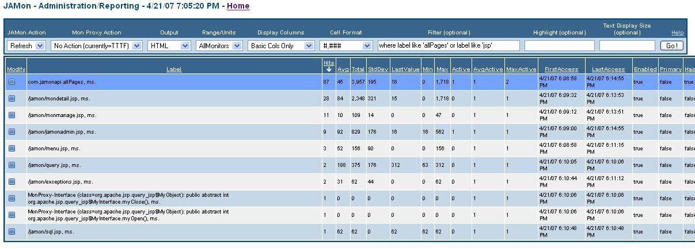
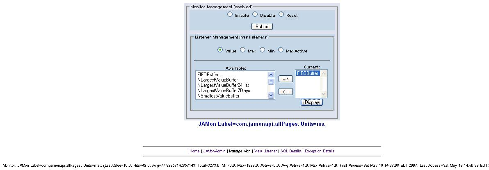
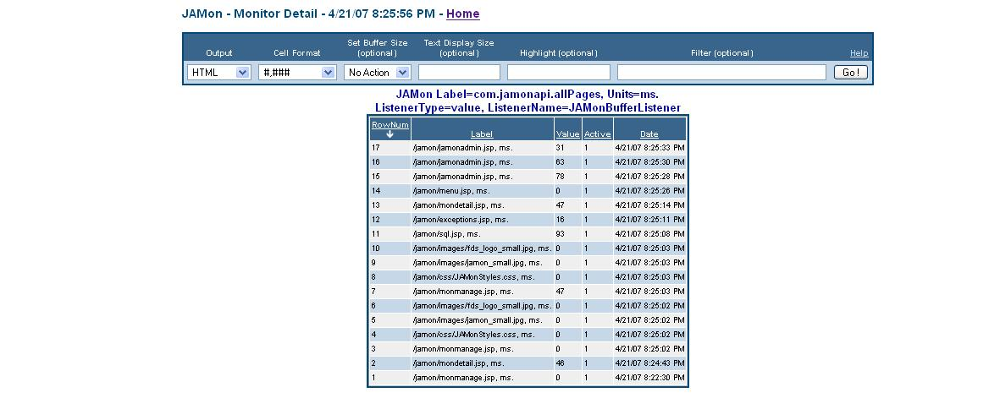
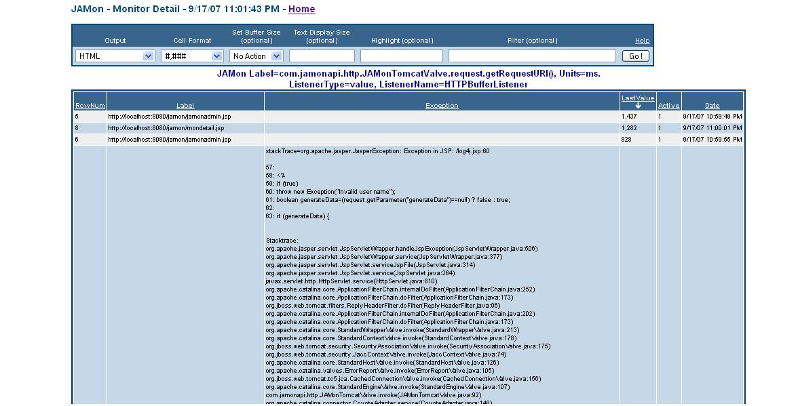

# JAMon Listeners - Listening to JAMon Events


## Quick Navigation

**Core Documentation:**
- [📋 Documentation Index](README.md) - Complete guide to all JAMon documentation
- [🚀 Getting Started](../README.md) - JAMon overview and quick start
- [⚡ Core API](core-api.md) - Basic JAMon monitoring concepts

**Integration Guides:**
- [🌐 Jakarta Servlet Filter](servlet-filter.md) - Web application monitoring
- [📊 SQL Monitoring](sql-monitoring.md) - Database monitoring
- [🔗 HTTP Monitoring](http-monitoring.md) - Container-level monitoring
- [🎯 Spring AOP](spring-aop-monitoring.md) - Spring framework integration
- [📈 JMX Monitoring](jmx-monitoring.md) - JMX metrics and management
- [📝 Log4j Appender](log4j-appender.md) - Logging framework integration

**Advanced Features:**
- [🌍 Distributed Monitoring](distributed-monitoring.md) - Hazelcast cluster integration
- [🖥️ JAMon Web App](jamon-war.md) - Web interface for monitoring data

## Table of Contents

- [What are JAMon Listeners?](#what-are-jamon-listeners)
- [Listeners that come with JAMon](#listeners-that-come-with-jamon)
- [JAMon MonKeys (not the animal)](#jamon-monkeys-not-the-animal)
- [JAMon MonKey Business](#jamon-monkey-business)
- [JAMon Listeners - An Example](#jamon-listeners---an-example)

## What are JAMon Listeners?

Previous versions of JAMon simply aggregated data. This was useful, but oftentimes we also want to see the details associated with an event of interest. The idea behind JAMonListeners is to keep details of more interesting events such as the values associated with the most recent calls to a monitor, or the calls that had the highest or lowest values. Recent and extreme values are often the most important in troubleshooting and performance tuning. JAMon comes with a number of JAMonListeners (described below), however developers can implement the JAMonListener interface and take appropriate action based on values within the JAMon monitor (i.e. hits/avg/max/min/...).

Each monitor has four 'Listener Event Types', and each of these can have zero, one or many JAMonListeners. Listeners can be managed (added/removed) etc from the 'monmanage.jsp' page accessible via the jamon.war application's 'jamonadmin.jsp' page. The monmanage.jsp page allows developers to select an available JAMonListener, and assign it to the current monitors 'listener type', or remove a current listener. These actions may also be performed programmatically via the JAMon api.

The four 'Listener Event Types' are listed and described below. If a JAMonListener is registered for a particular monitor then the listeners 'processEvent(Monitor mon)' method is called at the appropriate time.

### Listener Event Types

- **Value Listeners** - Are called everytime a monitor is fired. Because all fields are available in the listener different actions could occur based on information such as a monitor taking two times as long as the average. (`mon.getListenerType("value")`)
- **Max Listeners** - Are called whenever a value is greater than or equal to the monitors current maximum. (`mon.getListenerType("max")`)
- **Min Listeners** - Are called whenever a value is less than or equal to the monitors current minimum. (`mon.getListenerType("min")`)
- **Max Active Listeners** - Are called whenever a monitor has a new maximum concurrency greater than or equal to the monitors current max active value. Max active must also be greater than 1 to be called. (`mon.getListenerType("maxactive")`)

## Listeners that come with JAMon

The JAMon 3.0 release ships with the following JAMonListeners. They all inherit from JAMonBufferListener, which is a configurable buffer that allows you to view detail data such as the N most recent monitor values, or the N highest monitor values and more (N represents the configurable buffer size). This will be explained further in an example below. The values of any Listener that implements the `com.jamonapi.utils.DetailData` interface can be displayed via monmanage.jsp. JAMonBufferListener is such a Listener, and so can be displayed via monmanage.

The following is a description of the various JAMonListeners that come bundled with JAMon. All are based on JAMonBufferListener and so are size configurable buffers that by default hold 50 rows. The difference between them is in when a value is removed from a buffer, and whether a buffer can be shared between different monitors.

### Available Buffer Listeners

- **FIFOBuffer** - A buffer that holds a monitors N most recent values.
- **HTTPBufferListener** - A buffer that holds a monitors N most recent values. It will have the page that was executed, as well as the exception stack trace in another column should one have occurred. Note this is an example of the JAMonArrayBufferListener class which allows the detail buffer to have any number of columns.
- **ExceptionBufferListener** - Another FIFO buffer that has a label, and a stack trace should one have occurred.
- **NLargestValueBuffer** - A buffer that holds a monitors N largest values.
- **NSmallestValueBuffer** - A buffer that holds a monitors N smallest values.
- **NLargestValueBuffer7Days** - A buffer that holds a monitors N largest values as long as the value is not greater than 7 days old. Note although the web GUI only has implemented rolling buffers of 7 days, and 24 hours others are easily possible using the JAMon api.
- **NLargestValueBuffer24Hrs** - A buffer that holds a monitors N largest values as long as the value is not greater than 24 hrs old.
- **NSmallestValueBuffer7Days** - A buffer that holds a monitors N smallest values as long as the value is not greater than 7 days old.
- **NSmallestValueBuffer24Hrs** - A buffer that holds a monitors N smallest values as long as the value is not greater than 24 hours old.
- **SharedFIFOBuffer** - Shared buffers behave the same as their similarly named non-shared counterparts. They differ in that they can be shared among different monitors. This means that different monitors can write to the same buffer. In addition to being assigned to a monitor shared listeners are also placed in the available listeners listbox in the JAMon web app. They can be recognized as they will have a format like the following `_SharedFIFOBuffer1`
- **SharedNLargestValueBuffer**
- **SharedNSmallestValueBuffer**
- **SharedNLargestValueBuffer7Days**
- **SharedNLargestValueBuffer24Hrs**
- **SharedNSmallestValueBuffer7Days**
- **SharedNSmallestValueBuffer24Hrs**

### Registering Custom Listeners

To register your own listener so it can be assigned to a monitor via the monmanage.jsp page, simply call `com.jamonapi.JAMonListenerFactory.put(new MyListener())`. Some useful JAMonListeners would write monitors to a log or database, send an email, or put values in a buffer if a key matches a regular expression.

In addition monitors can be enabled/disabled/reset from the monmanage.jsp page.

Note JAMon monitor ranges can also have JAMonListeners associated with them. However this must be done programmatically as the gui doesn't currently support this functionality.

## JAMon MonKeys (not the animal)

JAMon takes a key as an argument and aggregates the passed in number whenever the same key is passed. Here are some examples:

```java
Monitor mon = MonitorFactory.start("com.jamonapi.pageHits");
// ...code being timed
mon.stop();
```

The code below is equivalent to the following. In fact behind the scenes the JAMon factory always uses MonKeys:

```java
MonKey key = new MonKeyImp("com.jamonapi.pageHits", "ms.");
Monitor mon = MonitorFactory.start(key);
// ...code being timed
mon.stop();
```

The principle is the same for non-time related monitors.

```java
MonKey key = new MonKeyImp("outgoing.BufferFull", "percent");
Monitor mon = MonitorFactory.add(key, 85); // 85% full
```

Everytime JAMon sees the same key it aggregates any passed value and associates the aggregations to the key.

Monitors can be returned without starting or adding to them in the following manner. The example gets a time monitor and adds several listener to it if there isn't one yet.

```java
Monitor mon = MonitorFactory.getMonitor("com.jamonapi.pageHits","ms.");

if (!mon.hasListeners()) {
    JAMonListener listener = JAMonListenerFactory.get("NLargestValueBuffer");
    mon.getListenerType("value").addListener(listener);

    listener = JAMonListenerFactory.get("NLargestValueBuffer7Days");
    mon.getListenerType("value").addListener(listener);

    listener = JAMonListenerFactory.get("NLargestValueBuffer24Hrs");
    mon.getListenerType("value").addListener(listener);

    listener = JAMonListenerFactory.get("FIFOBuffer");
    mon.getListenerType("value").addListener(listener);
}
```

## JAMon MonKey Business

JAMon depends on uniqueness of strings to aggregate by this common key. For example the following is used in `com.jamonapi.JAMonServletFilter` to track the performance of all web pages in an application. No matter what the page name is it will appear in the JAMon report with the 'com.jamonapi.pageHits' label:

```java
MonKey key = new MonKeyImp("com.jamonapi.pageHits", "ms.");
Monitor mon = MonitorFactory.start(key);
```

However it would be useful to look at the exact page name in a JAMonBufferListener. JAMon 2.4 introduced the concept of a Detail string to all MonKeys. Simply add the details to the second argument of the constructor.

```java
MonKey key = new MonKeyImp("com.jamonapi.pageHits", "/myapp/mypage.jsp?fname=steve&lname=souza", "ms.");
Monitor mon = MonitorFactory.start(key);
```

The above will still aggregate by the summary "com.jamonapi.pageHits" label, but will put the more detailed string that shows what page executed as well as its parameters in the JAMonBufferListener. JAMon calls that are not passed a detail string will place the summary label into the JAMonBufferListener buffer.

## JAMon Listeners - An Example

Let's work through an example of assigning a FIFOBuffer (An example of a JAMonBufferListener) to a value and max event. These will be called whenever a web application page hit occurs that is monitored with the JAMonServletFilter, or a new maximum occurs for page execution time respectively. Using a FIFOBuffer in these situations will allow us to look at the performance time of the last N recent page hits, and the N most recent maximum page execution times via the monmanage.jsp web page. Although this example explains a JAMonBufferListener any class that implements the JAMonListener interface would work in a similar manner.

This example uses the JAMonFilter servlet filter which tracks page hits via JAMon. It requires no coding. Simply include the JAMonFilter lines in your web.xml file as follows and make the jamon jar file available to your server (See the main users guide for more detailed instructions).

The above filter will track performance of all pages. The results when enabled for jamon.war look as follows. Note there will be one row for each page and also every page will also call a monitor with the label "com.jamonapi.pageHits". The following code is similar to what is in the JAMonFilter (but the page name is dynamic).

```java
MonKey key = new MonKeyImp("com.jamonapi.pageHits", "/myapp/mypage.jsp?fname=steve&lname=souza", "ms.");
Monitor mon = MonitorFactory.start(key);
```

The top row in the JAMon report shows how this monitor would look.



We will now click on the blue square icon to modify the monitor and add a value and max JAMonBufferListener. This will pull up the monmanage.jsp page and allow us to manage the "com.jamonapi.pageHits" monitor.

The top portion of this screen allows you to enable/disable/reset the selected monitor. The bottom portion of the screen allows you to associate a listener to a monitor event such as at every monitor invocation (value listener), or when a new max, min or max active value occurs. The web application attaches 'Available Listeners' to a monitor by calling the JAMonListenerFactory's 'put' method. To associate a FIFOBuffer with this monitor's value listener type simply select the 'Value' radio button, highlight FIFOBuffer in the 'Available' Listener list box, and then click the right arrow button. Repeat the process for the 'Max' listener. Note the listeners will now indicate they are associated with the monitor by appearing in the 'Current' Listeners list box. A sample screen follows:



To remove a Listener simply select the 'Current' Listener you would like to remove and click on the left arrow button. You can associate any number of listeners to a monitor. The 'Current' and 'Available' listeners list boxes are multi-select which allows multiple JAMonListeners to be added or removed simultaneously.

If the monitor implements the JAMon `com.jamonapi.utils.DetailData` interface (as JAMonBufferListener does), you can look at its data in the JAMon mondetail.jsp by selecting it from the 'Current' Listeners list box, and clicking on the 'Display' button (note double clicking the listbox will not work at this time). A screen snapshot of the mondetail.jsp follows with data from the value listener. The monitor label is "com.jamonapi.pageHits", but note that the details contain the actual page name as passed to the MonKeyImp constructor.

This is a flexible approach, that works for all monitor types. For example you could always track the details of a particularly slow query. The JAMonBufferListener was inspired by the SQL, and Exception pages from previous versions of JAMon. This concept is now more flexible and generic.

Note as in all JAMon screens the results are sortable and filterable. Click this link to see a [live demo](http://www.ssouza.com/jamon) of JAMon and its listener capabilities.



The following is an example of an HttpBufferListener (An ExceptionBufferListener would look the same). The first three rows had no exceptions. The stack trace occurred in the log4j.jsp file. Note also developers can pass any number of columns to the details of a monitor for display (via Object[], or a List).



## Jakarta EE and JAMon 3.0 Considerations

With JAMon 3.0's migration to Jakarta EE and Java 17+, the listener architecture remains fully compatible while providing enhanced performance and modern features:

- All existing listener implementations work seamlessly with the new modular architecture
- Enhanced thread safety and concurrency support for high-performance applications  
- Improved memory efficiency with better garbage collection integration
- Full compatibility with reactive and asynchronous programming models

The listener framework continues to be one of JAMon's most powerful features for detailed performance analysis and monitoring in modern Java applications.