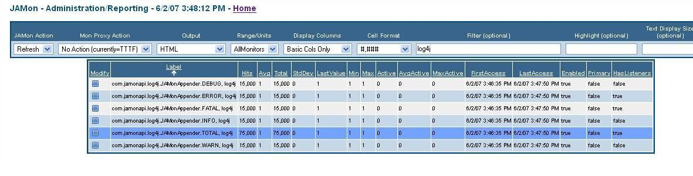
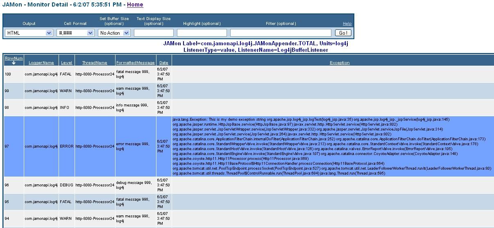
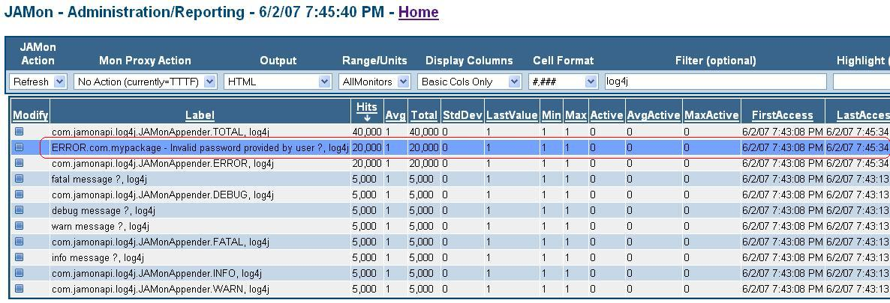
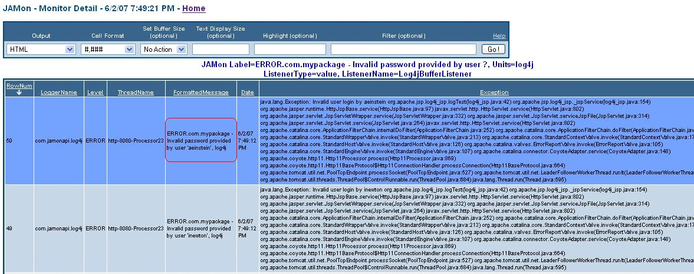

# JAMon Log4j Appender


## Quick Navigation

**Core Documentation:**
- [📋 Documentation Index](README.md) - Complete guide to all JAMon documentation
- [🚀 Getting Started](../README.md) - JAMon overview and quick start
- [⚡ Core API](core-api.md) - Basic JAMon monitoring concepts

**Related Guides:**
- [📈 JMX Monitoring](jmx-monitoring.md) - View Log4j metrics via JMX
- [👂 JAMon Listeners](listeners.md) - Event listeners for detailed log monitoring
- [🖥️ JAMon Web App](jamon-war.md) - Web interface for viewing log monitoring data
- [🌐 Jakarta Servlet Filter](servlet-filter.md) - Web application monitoring

## Table of Contents

- [Some Problems with Log Files](#some-problems-with-log-files)
- [How does JAMon enhance Log4j?](#how-does-jamon-enhance-log4j)
- [Background on Log4j Appenders](#background-on-log4j-appenders)
- [A Very Brief JAMon Primer](#a-very-brief-jamon-primer)
- [Setting up the JAMonAppender - Default Behaviour](#setting-up-the-jamonappender---default-behaviour)
- [Using the JAMonAppender to mimic 'tail'](#using-the-jamonappender-to-mimic-tail)
- [Using the JAMonAppender to aggregate and 'tail' individual messages - Generalizing](#using-the-jamonappender-to-aggregate-and-tail-individual-messages---generalizing)

## Some Problems with Log Files

Logs although useful, can be difficult to gather information from because:

- **You must have read access to logs** - Many developers do not have such rights. Even when they do they must remain logged into a server and tail the log to see what is written to the log. This becomes even more complicated as logs roll over, or if you need to tail for different messages in a log (say 'invalid login', and 'deadlock').

- **Log Details can be overwhelming** - A log contains so many details that it is difficult to pick your way through them and learn how your application is behaving. Often the amount of data is so overwhelming logs are often 'write only' information graveyards. Useful summary information such as "How many errors have occurred in my application, and when did they last occur?" are difficult to extract from a log file.

The Log4j JAMonAppender solves these problems and more as it allows you to view a "summarized" version of your log, as well as the details of your most recent log messages, all via the sortable/searchable JAMon web application.

## How does JAMon enhance Log4j?

Wouldn't it be nice to be able to do the following with your Log4j log files?

- **Summarize logs based on log Levels** - Tell how many calls were made to the Logger's different Level methods (trace/debug/warn/info/error/fatal) and when they occurred.

- **Summarize logs based on message content** - Tell how many messages with any given content have been logged, and when they were last logged. An example would be to get a count of how many times the message of the format 'Invalid Password provided by user XXX' occurred in your log file.

- **"Tail" logs based on log Levels** - Do a tail on the most recent Logger calls to the different Level methods so you could see what were the most recent debug, error messages etc., logged by an application.

- **"Tail" logs based on message content** - Do a tail on a particular message pattern like 'Invalid Password provided by user XXX'.

- **Display all of the above in real-time with no code changes via a web application.**

JAMon 2.6 introduces the Log4J JAMonAppender which allows you to do all of the above and more with log4j1. JAMon 2.82 and higher works with log4j2 (and no longer works with log4j1).

JAMon can also track real-time performance stats for SQL statements, and web pages (See http://www.jamonapi.com for more info). Because JAMon is an API it can easily be used in any application to monitor anything you desire via 3 basic methods: start/stop/add. In fact the JAMonAppender capabilities only took a couple days to implement by calling the JAMon `MonitorFactory.add(...)` method. The rest of this document will further explain how Log4j users can benefit by using JAMon.

### Analogy to Database Operations

Here are some simple ways to understand how the JAMonAppender is both similar and different to logging to a file:

- If logs are analogous to the detailed rows in a database table, then JAMon is analogous to performing a query with a 'group by' clause on the log.
- JAMon doesn't just contain summary information, it also contains details. As JAMon is a memory based tool (which makes it fast) it cannot grow as large as a log file, however it can work like tail in that it can keep the most recent N rows in memory for viewing via a web page.

## Background on Log4j Appenders

[Log4j2](https://logging.apache.org/log4j/2.x/) allows logging requests to be sent to multiple destinations including a console, file, database, or even a Socket Server. Log4j uses its [Appender](https://logging.apache.org/log4j/2.x/log4j-core/apidocs/org/apache/logging/log4j/core/Appender.html) interface to accomplish this. Log4j allows developers to attach multiple Appenders to each Logger via a property file, XML configuration file or programmatically via the Log4J API.

Loggers call their attached Appenders every time the Logger's trace/debug/warn/info/error/fatal methods are called. The Appender's `append(LogEvent event)` method is called. An instance of the Log4j LogEvent object is passed to the Appender. The LogEvent has context information about the message being logged.

## A Very Brief JAMon Primer

JAMon is based on a very simple concept of passing a key and a numeric value to an add method (`MonitorFactory.add(key, numericValue)`) and every time JAMon gets passed the same key it adds this value to the aggregated stats (hits/avg/min/max/total/...) already associated with this key. The key can represent anything (a SQL statement, a web page, in the case of Log4j a log message or anything else you can think of). The key should be 'relatively' distinct as every unique key will reside in memory (i.e. don't put a sequential counter or timestamp in your key).

### Examples

- If every time the Log4j method `logger.error(...)` is called we call the following JAMon add method we could count how many times 'error' was called. ('log4j' will be in JAMon's units column). The value of '1' simply adds '1' to the aggregated totals with each call.
  ```java
  MonitorFactory.add("ERROR", "log4j", 1);
  ```

- If you generalize a log4j message before sending it to JAMon we can keep aggregate statistics on how many times that log message has been called. The following would allow you to track how many times your application threw a particular Exception (assuming a custom Exception for your app). Note the JAMonAppender uses a similar approach which we will discuss below. Note the use of runtime data in the monitor label.
  ```java
  MonitorFactory.add("MyAppException." + myAppException.getShortMessage(), "Exception", 1);
  ```

- JAMon's start/stop methods aggregate time in milliseconds. Assuming every time a query of the generalized format 'select * from table where name=?' was executed start/stop were called in the following manner we would have aggregate stats for the query.
  ```java
  Monitor mon = MonitorFactory.start("select * from table where name=?");
  // ...code being executed...
  mon.stop();
  ```

### JAMon Listeners

JAMon has a concept similar to Log4j's Appenders. They are called JAMonListeners. Every time `MonitorFactory.add(...)` is called any registered JAMonListeners are notified and given the numeric value the method was passed as well as any contextual information. JAMon comes with some very useful JAMonListeners. One of them is the FIFOBuffer which keeps the most recent N (configurable via Log4j or the JAMon web app) messages written to the monitor associated with the key.

See the following links for more info on [JAMon](../README.md) and [JAMonListeners](listeners.md).

## Setting up the JAMonAppender - Default Behaviour

Setting up the JAMonAppender should only take a few minutes. The steps follow:

1. [Download JAMon](http://sourceforge.net/project/showfiles.php?group_id=96550) and extract the following from the zip file
2. Put JAMon's jar file in your classpath (`jamon-core-3.0.jar` for JAMon 3.0, or `jamon-2.x.jar` for legacy versions)
3. Install `JAMon.war` in your application, so you can view your Log4J statistics and log records
4. Configure Log4j to use JAMon's Appender
5. The JAMon web application has a `log4j.jsp` which will exercise the JAMonAppender. You must have both JAMon and Log4j in your classpath for the page to work. You can access this page with the following link: `http://yourhost:port/jamon/log4j.jsp`

### Default Behavior

Note the JAMonAppender has useful default behavior. By default JAMon keeps summary stats of how many times each of the different logging methods are called (trace/debug/warn/info/error/fatal). Each of these correspond to a label in the JAMon report of the format `com.jamonapi.log4j.JAMonAppender.LEVEL` where LEVEL is replaced by one of the Levels such as DEBUG.

The report indicates that log methods associated with each of the different levels were called 15,000 times. The "LastAccess" column indicates when the method associated with the JAMon label was last called. Most of the other columns have no real meaning to Log4j, as we are only counting method calls and so fields like 'Max' have no meaning in this context. Notice there is also a JAMon row with the label `com.jamonapi.log4j.JAMonAppender.TOTAL` and that it had 75,000 hits (15,000 for each of the 5 Levels). This monitor is incremented whenever any of the logger's log methods are executed regardless of Level (i.e. it represents all log methods that were called).



This behavior is by default enabled, but if you wish to turn it off you can set the following JAMonAppender property: `EnableLevelMonitoring=false`

**Note:** Many of the JAMon web pages can be 'queried' via the [FormattedDataSet](http://www.fdsapi.com) API ArraySQL class which allows you to query JAMon's internal data structures with a SQL like syntax. Don't be confused by this. JAMon data is not kept in a database but is stored in memory. The screen snapshot shows how only 'log4j' JAMon rows are displayed by putting 'log4j' in the filter text box. For more info on querying data see the page's help section as well as the FormattedDataSet.

The default behavior is already useful for answering such questions as "When did an error last occur?", or "How many errors have occurred in my application?". Finding this out is much easier via the `jamonadmin.jsp` page than it would be by grepping or tailing a log file.

## Using the JAMonAppender to mimic 'tail'

By adding the 'EnableListeners' property you will be able to use JAMon to view the most recent messages in a buffer that is kept for each of the Log4j Levels (trace/debug/warn/info/error/fatal/total).

### Basic Configuration

Sample JAMonAppender XML configuration values that enable BASIC listeners follows:

```xml
<?xml version="1.0" encoding="UTF-8"?>
<Configuration>
    <Appenders>
        <Console name="Console" target="SYSTEM_OUT">
            <PatternLayout pattern="%d{HH:mm:ss.SSS} [%t] %-5level %logger{36} - %msg%n"/>
        </Console>
        <JamonAppender name="JamonAppender" enableListeners="BASIC">
        </JamonAppender>
    </Appenders>
    <Loggers>
        <Root level="info">
            <AppenderRef ref="Console"/>
            <AppenderRef ref="JamonAppender"/>
        </Root>
    </Loggers>
</Configuration>
```

### EnableListeners Options

BASIC means to track the most recent N log messages at the error/fatal/total levels. This means that we will have 3 buffers each of 100 rows (this is configurable via a JAMonAppender or at runtime via the JAMon war. The default is 100 rows) that will contain Log4J data including the message.

**Valid values for the EnableListeners property:** DEBUG/WARN/INFO/ERROR/FATAL/TOTAL/ALL/BASIC/NONE. ALL enables individual buffers for each of the Levels as well as for TOTAL.

### Viewing Buffer Data

To view the Log4jBufferListener click on the blue square labeled "Modify" on the `jamonadmin.jsp` page (see image above). From the "Modify" from the "Current" JAMonListeners list box select to display "Log4jBufferListener" and you will get a screen similar to the following (if you select TOTAL from jamonadmin.jsp). Note the different Level values in the Levels column due to the fact that we selected 'TOTAL'. If you select a buffer for one Level (say ERROR) it would only have the most recent N messages of that Level in the buffer. Also note the Exception stack trace. And finally the message sent to the 'log' methods is contained in the "FormattedMessage" column.



## Using the JAMonAppender to aggregate and 'tail' individual messages - Generalizing

JAMon can also keep aggregate stats, and the N most recent detailed messages based on content within the logged message itself. Be careful when using the following capabilities as if the String isn't 'relatively unique' then JAMon's memory can grow unbounded (each row in JAMon is a HashMap entry).

### Generalization Examples

The following example will allow us to take specific Strings that are passed to a Log4j logging method (debug/warn/error etc.) and 'generalize' them so they can also be placed into JAMon. A couple examples will make this concept more clear and show the benefit:

- If `logger.error("Invalid password provided by user 'mbobish'")` is called JAMon will generalize this String to "Invalid password provided by user ?", and call `MonitorFactory.add(...)` on this String. This will allow us to use JAMon to see how many times this error was called and when it last occurred. It keeps the specific/non-generalized log message for placement in a Log4jBufferListener if this monitor is configured to do as such. Note this message will also be available in the ERROR/TOTAL Log4jBufferListeners should they be enabled.

- If `logger.error("User 'jbeck' exceeded purchase limit of 1000 dollars")` is called JAMon will generalize this to "User ? exceeded purchase limit of ? dollars", and call `MonitorFactory.add(....)` on this String.

### Generalization Rules

The JAMonAppender implements the following simple rules in generalizing these Strings:

- **Replace all Strings in single or double quotes with a '?'** - Examples: "ssouza", 'tablename' both become ? in the returned String.

- **Replace all numbers that standalone or have a non-alpha next to them with a '?'** - Example: 155 becomes ?, 145.55 becomes ?.?, address_1 becomes address_?, address1 is unchanged, 5/15/1962 8:00 PM becomes ?/?/? ?:? PM, '5/15/1962 8:00 PM' becomes ? based on the first rule.

### Custom Generalization

To perform generalization the JAMonAppender uses `com.jamonapi.utils.DefaultGeneralizer` which implements the `com.jamonapi.utils.Generalizer` interface. However, as this is a simple interface with one method (`String generalize(String input)`) you can implement it and easily replace the default behavior.

Take care to surround portions of Strings that aren't very unique with quotes, so they are replaced with '?' (examples would be names that occur in a message such as 'smith', 'jones', 'souza', 'jagger'). If the string is already relatively unique then you need not surround its contents with quotes.

### Generalization Configuration

The JAMonAppender property 'generalize' specifies that the JAMonAppender should take the log message generalize it with the DefaultGeneralizer and pass the results through JAMon. The following example would take a String a log message of the format:

    Invalid password provided by user 'aeinstein'

and convert it to

    Invalid password provided by user ?

And create a JAMon entry with the new String and put the original detailed String in a buffer for this monitor label (if enabled). The following information shows the XML configuration file used to do this:

```xml
<?xml version="1.0" encoding="UTF-8"?>
<Configuration>
  <Appenders>
    <Console name="Console" target="SYSTEM_OUT">
        <PatternLayout pattern="%d{HH:mm:ss.SSS} [%t] %-5level %logger{36} - %msg%n"/>
    </Console>
    <JamonAppender name="JamonAppender" generalize="true" enableListeners="BASIC">
        <PatternLayout pattern="%d{HH:mm:ss.SSS} [%t] %-5level %logger{36} - %msg%n"/>
    </JamonAppender>
  </Appenders>
  <Loggers>
    <Root level="trace">
        <AppenderRef ref="Console"/>
        <AppenderRef ref="JamonAppender"/>
    </Root>
  </Loggers>
</Configuration>
```

### Viewing Generalized Data

The following screen snapshot from `jamonadmin.jsp` shows that the generalized form of the log message was called 20,000 times:



Assuming we have enabled a JAMon "FIFOBuffer" for the generalized monitor we can view the N most recent details written to the buffer via `mondetail.jsp`. Note the non-generalized form is put in the buffer (In this case that can be identified by 'aeinstein'). Unfortunately at this time the only way to enable buffer listeners for log message monitors is via the JAMon web app or programmatically (i.e. it can't be done via Log4j configuration files):



## Configuration Examples

### Basic Configuration (Level Monitoring Only)
```xml
<JamonAppender name="JamonAppender">
</JamonAppender>
```

### With Buffer Listeners
```xml
<JamonAppender name="JamonAppender" enableListeners="BASIC">
</JamonAppender>
```

### With Generalization
```xml
<JamonAppender name="JamonAppender" generalize="true" enableListeners="ALL">
    <PatternLayout pattern="%d{HH:mm:ss.SSS} [%t] %-5level %logger{36} - %msg%n"/>
</JamonAppender>
```

### Advanced Configuration
```xml
<JamonAppender name="JamonAppender" 
               enableListeners="ERROR,FATAL,TOTAL" 
               generalize="true"
               enableLevelMonitoring="true"
               bufferSize="200">
    <PatternLayout pattern="%d{HH:mm:ss.SSS} [%t] %-5level %logger{36} - %msg%n"/>
</JamonAppender>
```

## JAMon 3.0 Log4j Integration

With JAMon 3.0's modular architecture:
- **Enhanced Performance** - Improved logging overhead and memory efficiency
- **Jakarta EE Compatibility** - Works with modern logging frameworks
- **Thread Safety** - Enhanced concurrency support for high-throughput logging
- **Modular Design** - Include only what you need for logging monitoring

## Sample Configuration File

For a complete configuration example, see: [JAMonAppender Sample Log4j XML file](../src/LegacyJAMonUsersGuide285/log4j_jamonappender.xml)

## Related Documentation

- [JMX Monitoring](jmx-monitoring.md) - View Log4j metrics via JMX
- [JAMon Listeners](listeners.md) - Event listeners for detailed log monitoring
- [Core API Guide](core-api.md) - Basic JAMon monitoring concepts
- [JAMon WAR](jamon-war.md) - Web interface for viewing log monitoring data