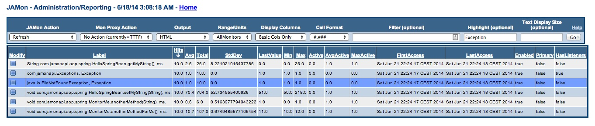
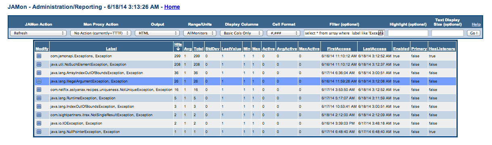
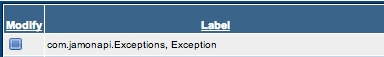
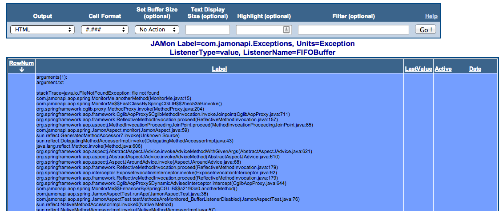

# JAMon Spring AOP Monitoring


## Quick Navigation

**Core Documentation:**
- [📋 Documentation Index](README.md) - Complete guide to all JAMon documentation
- [🚀 Getting Started](../README.md) - JAMon overview and quick start
- [⚡ Core API](core-api.md) - Basic JAMon monitoring concepts

**Related Guides:**
- [🌐 Jakarta Servlet Filter](servlet-filter.md) - Web application monitoring
- [📊 SQL Monitoring](sql-monitoring.md) - Database monitoring
- [🗝 Log4j Appender](log4j-appender.md) - Logging integration
- [👂 JAMon Listeners](listeners.md) - Event listeners for detailed monitoring
- [🖥️ JAMon Web App](jamon-war.md) - Web interface for monitoring data

## Table of Contents

- [Introduction](#introduction)
- [How does it work?](#how-does-it-work)
- [What does it look like?](#what-does-it-look-like)

## Introduction

JAMon and Aspect Oriented Programming are a perfect pairing. JAMon can wrap any method call and track concurrency, performance, exceptions and also view the N most recent invocations to name a few of the possibilities. With JAMon you can monitor all of your Spring beans using either annotations or by putting a few lines in your `applicationContext.xml` file.

It should only take a few minutes to start monitoring all your Spring beans.

### JAMon vs Spring's Built-in Interceptor

Spring comes with the [JamonPerformanceMonitorInterceptor](http://docs.spring.io/spring/docs/3.0.x/api/org/springframework/aop/interceptor/JamonPerformanceMonitorInterceptor.html) which also allows you to monitor your Spring beans with JAMon. Feel free to use it if you wish. The two approaches both do about the same thing. The only difference in the collected data is that the [JamonAspect](https://sourceforge.net/p/jamonapi/jamonapi/ci/master/tree/jamon/src/main/java/com/jamonapi/aop/spring/JamonAspect.java) also allows you to track the parameters that were passed to the method.

### Enhanced Features with JamonAspect

- **Track Specific Exceptions** - If the method you are monitoring throws an exception, JamonAspect counts the specific exception (i.e. `java.io.FileNotFoundException`)
- **Track General Exceptions** - JamonAspect also keeps a total count for all exceptions thrown (the label is `com.jamonapi.Exceptions`)
- **View stacktraces** - By default JamonAspect lets you view the 50 most recent stacktraces (configurable) that have occurred in your application via the JAMon webapp viewer. It can also be configured to view the stack traces of specific exceptions (i.e. `java.io.FileNotFoundException`)
- **View method parameters** - JamonAspect can be configured to display the method parameters used in the invoked method. This is particularly useful in a development or staging environment. This is disabled by default
- **View method parameters when exceptions are thrown** - JamonAspect can be configured to display the method parameters when a method throws an exception. This is also disabled by default

### Important Notes

**Note1:** It should be noted that it would be easy to change the code in JamonPerformanceMonitorInterceptor to perform all of the above. In the future, I will try to work with the Spring team to get them to enhance their code.

**Note2:** Spring may use the [CGLIB proxy mechanism](http://docs.spring.io/spring/docs/3.0.0.M3/reference/html/ch08s06.html). If so, any class being monitored requires a no-arg constructor. The constructor can be private however. It also requires setters for any of the variables that the actual constructor takes (say a 2 arg constructor). These setters may also be private.

## How does it work?

There are various ways to configure the JamonAspect to monitor your spring beans. AspectJ's pointcut language is very powerful and flexible. It allows you to associate an aspect to all classes in a given package, all classes with a given annotation, classes that match a pattern and much more. You can also choose not to monitor the whole class, and instead monitor select methods. To learn more about AOP and AspectJ's pointcuts see [Spring AOP](http://docs.spring.io/spring/docs/3.2.x/spring-framework-reference/html/aop.html).

### Configuration Examples

See [minimalApplicationContext.xml](https://sourceforge.net/p/jamonapi/jamonapi/ci/master/tree/jamon/src/test/resources/minimalApplicationContext.xml) for a simple example of how to monitor a spring bean using a bean name.

See [applicationContext.xml](https://sourceforge.net/p/jamonapi/jamonapi/ci/master/tree/jamon/src/test/resources/applicationContext.xml) for more examples of how to use AOP and Spring together. This file has a number of other ways to define pointcuts that are commented out. By looking at the file you may see some options that might fit your use case.

[JamonAspectTest](https://sourceforge.net/p/jamonapi/jamonapi/ci/master/tree/jamon/src/test/java/com/jamonapi/aop/spring/JamonAspectTest.java) test class shows how these files are used in Spring.

The next section shows JAMon data generated by executing the test method `JamonAspectTest.testMethodsAreMonitored()`.

## What does it look like?

### Basic Method Monitoring

Representative data collected by JamonAspect follows. The screen snapshot was taken from a `jamonadmin.jsp` in `jamon.war`. Review [applicationContext.xml](https://sourceforge.net/p/jamonapi/jamonapi/ci/master/tree/jamon/src/test/resources/applicationContext.xml) to see how all methods were selected for monitoring. Note as mentioned in the introduction exceptions are being tracked (`com.jamonapi.Exceptions`, and `java.io.FileNotFoundException`). All methods were called 10 times (hits).



### Exception Monitoring

Here is an example of how it might look like if your application had thrown a wider variety of exceptions. Note this screen was filtered to only view exceptions.



### Exception Details and Stack Traces

If the 'modify' icon is clicked for 'com.jamonapi.Exceptions' you can view the 'FIFOBuffer' which contains the stacktraces.



### Exception Arguments Tracking

The following screen snapshot shows what it might look like if exception arguments tracking was also enabled. You can see the stacktrace, the method that threw the exception as well as the arguments passed to the method (in this case 1 argument was passed and it was a filename: arguments.txt).



## Configuration Examples

### Basic AOP Configuration

```xml
<beans xmlns="http://www.springframework.org/schema/beans"
       xmlns:xsi="http://www.w3.org/2001/XMLSchema-instance"
       xmlns:aop="http://www.springframework.org/schema/aop"
       xsi:schemaLocation="
           http://www.springframework.org/schema/beans
           http://www.springframework.org/schema/beans/spring-beans.xsd
           http://www.springframework.org/schema/aop
           http://www.springframework.org/schema/aop/spring-aop.xsd">

    <!-- Enable AspectJ auto-proxy -->
    <aop:aspectj-autoproxy/>

    <!-- JAMon Aspect Bean -->
    <bean id="jamonAspect" class="com.jamonapi.aop.spring.JamonAspect"/>

    <!-- Configure pointcuts -->
    <aop:config>
        <aop:aspect ref="jamonAspect">
            <aop:pointcut id="businessMethods" 
                         expression="execution(* com.yourapp.service.*Service.*(..))"/>
            <aop:around pointcut-ref="businessMethods" method="monitor"/>
        </aop:aspect>
    </aop:config>

    <!-- Your business beans -->
    <bean id="userService" class="com.yourapp.service.UserService"/>
    
</beans>
```

### Annotation-Based Configuration

```java
@Component
@Aspect
public class JAMonMonitoringAspect {
    
    @Around("@annotation(com.jamonapi.aop.MonitorAnnotation)")
    public Object monitor(ProceedingJoinPoint joinPoint) throws Throwable {
        // JAMon monitoring logic
        return jamonAspect.monitor(joinPoint);
    }
}
```

```java
@Service
public class UserService {
    
    @MonitorAnnotation
    public User findById(Long id) {
        // Business logic
        return userRepository.findById(id);
    }
}
```

## JAMon 3.0 Considerations

With JAMon 3.0's modular architecture and Jakarta EE migration:

- **Spring Framework Compatibility** - Works with Spring Framework 5.x and 6.x
- **Jakarta EE Support** - Compatible with modern Jakarta EE applications
- **Enhanced Performance** - Improved monitoring overhead and memory efficiency
- **Thread Safety** - Enhanced concurrency support for high-performance Spring applications

## Best Practices

### Performance Considerations
- Monitor at service layer boundaries, not every method
- Use specific pointcuts to avoid over-monitoring
- Consider monitoring overhead in high-throughput scenarios
- Use JAMon's enable/disable features for production tuning

### Exception Monitoring
- Enable exception parameter tracking only in development/staging
- Configure appropriate buffer sizes for exception history
- Use specific exception monitoring for critical error types
- Combine with logging frameworks for comprehensive error tracking

### Integration Tips
- Test monitoring configuration in development first
- Verify CGLIB proxy requirements (no-arg constructors)
- Use Spring profiles to conditionally enable monitoring
- Monitor Spring's own components sparingly to avoid noise

## Related Documentation

- [Core API Guide](core-api.md) - Basic JAMon monitoring concepts
- [JAMon Listeners](listeners.md) - Event listeners for detailed monitoring
- [JAMon WAR](jamon-war.md) - Web interface for viewing monitoring data