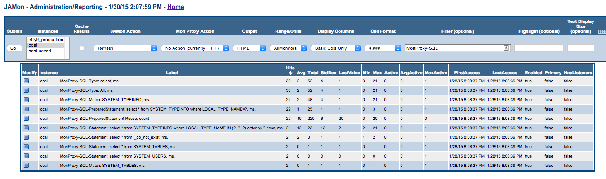
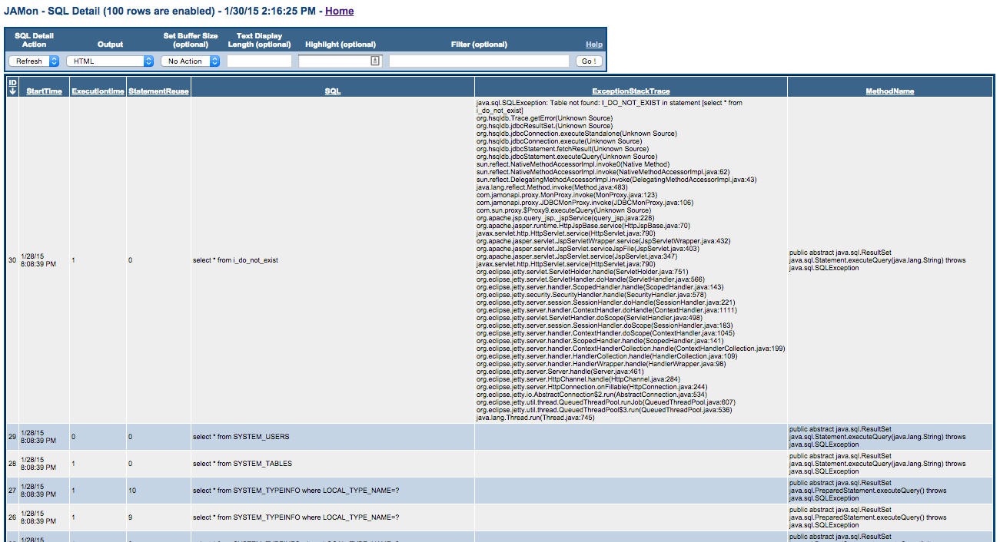
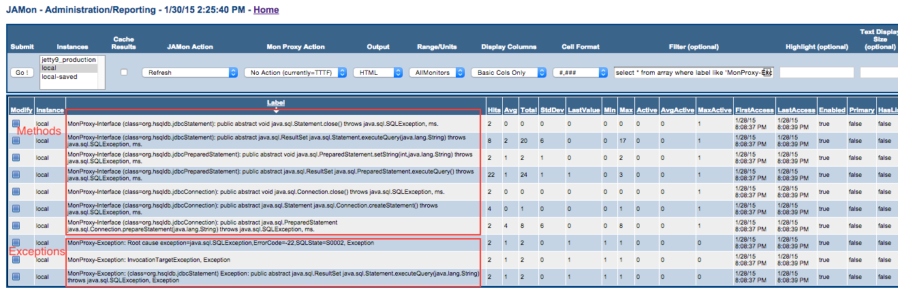

# JAMon SQL and JDBC Monitoring


## Quick Navigation

**Core Documentation:**
- [📋 Documentation Index](README.md) - Complete guide to all JAMon documentation
- [🚀 Getting Started](../README.md) - JAMon overview and quick start
- [⚡ Core API](core-api.md) - Basic JAMon monitoring concepts

**Related Guides:**
- [🌐 Jakarta Servlet Filter](servlet-filter.md) - Web application monitoring
- [🔗 HTTP Monitoring](http-monitoring.md) - Container-level monitoring
- [📝 Log4j Appender](log4j-appender.md) - Logging integration
- [👂 JAMon Listeners](listeners.md) - Event listeners for detailed monitoring
- [🖥️ JAMon Web App](jamon-war.md) - Web interface for monitoring data

## Table of Contents

- [How do I monitor my SQL/JDBC?](#how-do-i-monitor-my-sqljdbc)
- [Viewing SQL Summary Statistics](#viewing-sql-summary-statistics)
- [Viewing SQL Details](#viewing-sql-details)
- [Viewing JDBC methods and exceptions](#viewing-jdbc-methods-and-exceptions)

## Overview

One of the most powerful aspects of JAMon is that it can track performance for all queries issued by an application and allow developers to view all recent queries that have executed in a rolling buffer. In addition it can track JDBC method calls to Statements, ResultsSets and Connections and track any exceptions they throw.

The home screen of the JAMon web application allows you to generate and monitor SQL traffic to play with the capabilities without configuring your own database connection. The data in the screens below was generated this way, and the screen snapshots were taken from the JAMon web application too.

## How do I monitor my SQL/JDBC?

The JAMon JDBC driver allows developers to monitor JDBC/SQL without changing any code. The JAMonDriver class is `com.jamonapi.proxy.JAMonDriver` and representative URLs follow. Note JAMon simply sits in front of the real JDBC driver (`jamonrealdriver`) intercepts calls and then reroutes the calls to the real driver.

### JDBC URL Examples

- `jdbc:jamon:sybase:Tds:localhost:2638?jamonrealdriver=com.sybase.jdbc2.jdbc.SybDriver`
- `jdbc:jamon:sybase:Tds:myserver.mycompany.com:2638?jamonrealdriver=com.sybase.jdbc2.jdbc.SybDriver&PROTOCOL_CAPTURE=/opt/sw/eas/eas5/sched.log`
- `jdbc:jamon:opena:jamonrealdriver=com.asgardsw.OpenA.OpenADriver&159.234.234.164:5000/USR/DB/ (OPENA)CONFIG/AMWEB/DEV ON SOFTWARE`

### Configuration Examples

**JDBC Syntax Without JAMon:**
```java
Class.forName("com.sybase.jdbc2.jdbc.SybDriver");
String url = "jdbc:sybase:Tds:MyServerDNS:2638";
Connection conn = DriverManager.getConnection(url, user, passWord);
```

**JDBC Syntax With JAMon:**
```java
Class.forName("com.jamonapi.proxy.JAMonDriver");
String url = "jdbc:jamon:sybase.Tds:MyServerDNS:2638?jamonrealdriver=com.sybase.jdbc2.jdbc.SybDriver";
Connection conn = DriverManager.getConnection(url, user, passWord);
```

Note JAMon simply removes 'jamon', and 'jamonrealdriver=XXXX' from the url, so the url should work with the underlying driver when they are removed. Note the '?' above is not part of JAMon syntax, but instead part of the underlying Sybase driver syntax. In the Oracle example below, there is no delimiter between 'jamonrealdriver' and the previous part of the oracle driver, which looks odd, but it is appropriate.

**Oracle Example:**
```java
Class.forName("com.jamonapi.proxy.JAMonDriver");
String url = "jdbc:jamon:oracle:thin:@dbms:1521:DBjamonrealdriver=oracle.jdbc.OracleDriver";
Connection conn = DriverManager.getConnection(url, user, passWord);
```

## Viewing SQL Summary Statistics

A number of different JAMon summary statistics will be kept for each query executed from a monitored Statement/PreparedStatement/CallableStatement. JAMon labels for SQL summary statistics begin with: **MonProxy-SQL**. These summary statistics allow developers to see how many times a query has been executed, what its time statistics are (avg/total/min/max/...), whether or not it is currently executing and if so how many times, and more.

For each SQL command the following JAMon summary labels will appear in the JAMonAdmin report:

### SQL Monitor Types

- **MonProxy-SQL-Type** - Statistics for SQL commands of the following types: select, update, delete, insert, truncate, exec, create, drop, alter, commit, save, grant, revoke, and other. Essentially this is the first word of the SQL command, and other 'types' may be added by developers via the JAMon API. This monitor allows developers to see statistics (hits/avg time/concurrency/...) for select's/update's/delete's etc.
  - Example: `MonProxy-SQL-Type: select`

- **MonProxy-SQL-PreparedStatement** - This monitor will give statistics for every SQL command issued against a PreparedStatement/CallableStatement.
  - Example: `MonProxy-SQL-PreparedStatement: select * from SYSTEM_TYPEINFO where LOCAL_TYPE_NAME=?`

- **MonProxy-SQL-Statement** - This monitor will give statistics for every SQL command issued against a Statement. To allow aggregation all SQL argument values are replaced with '?'. For example, "select * from employee where name='steve'", and "select * from employee where name='jeff'" both become "select * from employee where name=?".
  - Example: `MonProxy-SQL-Statement: select * from employee where name=?`

- **MonProxy-SQL-PreparedStatement Reuse** - Counts how many times PreparedStatements are reused. One of the benefits of PreparedStatements is improved performance over Statements if they are reused. This monitor allows developers to see if they are reusing their PreparedStatements. Note this is an overall number and it is not tracked for individual queries.

- **MonProxy-SQL-Match** - The API allows developers to pass in any string and have a monitor show up if the string occurs in a query. The most obvious use of this is to pass in table names and see how many times the table occurs in queries and what the performance characteristics of these queries is. This can lead the way to detecting problem tables. One row will show up in the JAMonAdmin report for each match.
  - Example: `MonProxy-SQL-Match: SYSTEM_TYPEINFO`

SQL summary statistics are viewable via `jamonadmin.jsp` as this screen snapshot shows:



## Viewing SQL Details

The details of the most recent N SQL commands issued are kept in a rolling buffer and are viewable via `sql.jsp`. The SQL buffer size is configurable via the web page, and defaults to the most recent 100 queries.

Each row in the report represents a recently executed SQL command. By default the report is sorted with the most recent queries showing at the top. Each row contains the following columns:

### SQL Detail Columns

- **ID** - An increasing integer that indicates the number of the query since the server was last booted
- **StartTime** - The time the query started
- **ExecutionTime** - The time in milliseconds that the query took to run
- **StatementReuse** - Indicates how many times the PreparedStatement was reused. This value should be high to maximize the benefit of the PreparedStatement. The first time the PreparedStatement is used it will have a value of 0 and will increase with each reuse of the PreparedStatement. Statements will always have a value of 0 here as they aren't reused
- **SQL** - The query that executed. For statements it will include the parameter values. PreparedStatements will have '?' in place of values
- **ExceptionStackTrace** - If an error happened when executing the query this column will contain the stack trace. If no error occurred it will be empty
- **MethodName** - The JDBC method name that executed the query

SQL details are viewable via `sql.jsp` which is available from the JAMon web application home screen. This is a screen snapshot of `sql.jsp`:



## Viewing JDBC methods and exceptions

JDBC interface monitoring has all the capabilities mentioned in [interface monitoring](interface-monitoring.md), but also a few extra capabilities:

### JDBC-Specific Features

- **Automatic Monitoring**: Monitoring for Connection/Statement/PreparedStatement/CallableStatement/ResultSet JDBC interfaces does not require casting of the returned monitoring proxy.

```java
import com.jamonapi.proxy.*;

// The MyObject() class has to implement MyInterface for monitoring to work.
Connection monitoredConnection = MonProxyFactory.monitor(originalConnection);
```

- **Cascading Monitoring**: If a Connection is monitored then any Statement/PreparedStatement/CallableStatement/ResultSet returned is automatically monitored, and need not be wrapped by a call to `monitor(...)` itself

```java
import com.jamonapi.proxy.*;

// The MyObject() class has to implement MyInterface for monitoring to work.
Connection monitoredConnection = MonProxyFactory.monitor(originalConnection);
// The following is not needed to monitor a Statement. The statement is automatically monitored due to its connection being monitored
Statement statement = MonProxyFactory.monitor(monitoredConnection.createStatement());
```

- **Enhanced SQL Exception Information**: Due to the standardized nature of SQLExceptions they have more information in the JAMon summary report than other Exceptions. They include SQLError and SQLState information.
  - Example: `MonProxy-Exception: Root cause exception=java.sql.SQLException,ErrorCode=-22,SQLState=S0002`

This is a screen snapshot of the type of information that can be seen in `jamonadmin.jsp`. Methods and Exceptions are annotated in the example below:



## Related Documentation

- [Core API Guide](core-api.md) - Basic JAMon monitoring concepts
- [Interface Monitoring](interface-monitoring.md) - General interface monitoring capabilities
- [JAMon Listeners](listeners.md) - Event listeners for detailed monitoring